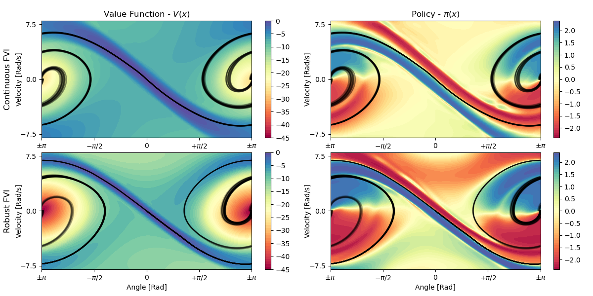
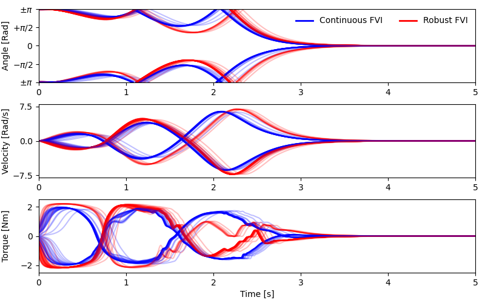

# Continuous & Robust Fitted Value Iteration
The open-source implementation of **continuous Fitted Value Iteration (cFVI)** as well as **robust Fitted Value 
Iteration (rFVI)** introduced in
- [Lutter et. al., (2021). Robust Value Iteration for Continuous Control Tasks, \
Robotics: Science and Systems (RSS)](https://arxiv.org/pdf/2105.12189.pdf).

- [Lutter et. al., (2021). Value Iteration in Continuous Actions, States and Time, \
 International Conference on Machine Learning (ICML)](https://arxiv.org/pdf/2105.04682.pdf).

- [Lutter et. al., (2021). Continuous-Time Fitted Value Iteration for Robust Policies, \
arXiv preprint arXiv:2110.01954](https://arxiv.org/pdf/2110.01954.pdf).

<p style='text-align: justify;'>
<b>Abstract:</b>
Solving the Hamilton-Jacobi-Bellman equation is important in many domains including control, robotics and economics.
Especially for continuous control, solving this differential equation and its extension the Hamilton-Jacobi-Isaacs equation, is important
as it yields the optimal policy that achieves the maximum reward on a give task. In the case of the Hamilton-Jacobi-Isaacs equation,
which includes an adversary controlling the environment and minimizing the reward, the obtained policy is also robust to perturbations
of the dynamics. In this paper we propose continuous fitted value iteration (cFVI) and robust fitted value iteration (rFVI). These
algorithms leverage the non-linear control-affine dynamics and separable state and action reward of many continuous control problems
to derive the optimal policy and optimal adversary in closed form. This analytic expression simplifies the differential equations and
enables us to solve for the optimal value function using value iteration for continuous actions and states as well as the adversarial case.
Notably, the resulting algorithms do not require discretization of states or actions. We apply the resulting algorithms to the Furuta
pendulum and cartpole. We show that both algorithms obtain the optimal policy. The robustness Sim2Real experiments on the physical
systems show that the policies successfully achieve the task in the real-world. When changing the masses of the pendulum, we
observe that robust value iteration is more robust compared to deep reinforcement learning algorithm and the non-robust version of the
algorithm. Videos of the experiments are shown at https://sites.google.com/view/rfvi
</p>

  
<p style='text-align: justify;'>
<b>Figure 1:</b> The optimal value function and policy computed using cFVI and rFVI on the torque-limited pendulum. In 
comparison to cFVI, the min-max optimization of rFVI causes the optimal policy to exert higher actions when deviating 
from the optimal trajectory. The ridge leading up to the upright pendulum is much smaller to account for potential
disturbances. 
</p>

<p style='text-align: justify;'> <b>Example:</b>
This example computes the value function of the torque-limited pendulum using cFVI & rFVI. After each evaluation the
current policy is used to control the system and the obtained reward is printed. To start training  the value function,
execute
</p>

```
# Train the value function from scratch
python pendulum_experiment.py -alg [cfvi|rfvi] -load 0 -seed 42

# Evaluate the trained model
python pendulum_experiment.py -alg [cfvi|rfvi] -load 0 -seed 42
```


<p style='text-align: justify;'>
<b>Figure 2:</b> The optimal trajectories of the cFVI and rFVI policies on the torque limited pendulum. Both optimal
policies achieve the swing-up and balance the pendulum upright. The rFVI policy
applies larger actions than the cFVI policy and accelerates the pendulum to higher velocities. Due to the higher actions
the rFVI achieves a marginally lower reward than the cFVI policy but is more robust.
</p>

**Citation:** \
If you use this implementation within your paper, please cite:

```
@inproceedings{lutter2021value,
	title        = {Value Iteration in Continuous Actions, States and Time},
	author       = {Michael Lutter and Shie Mannor and Jan Peters and Dieter Fox and Animesh Garg},
	year         = 2021,
	booktitle    = {International Conference on Machine Learning (ICML)}
}
@inproceedings{lutter2021robust,
	title        = {Robust Value Iteration for Continuous Control Tasks},
	author       = {Lutter, Michael and Mannor, Shie and Peters, Jan and Fox, Dieter and Garg, Animesh},
	year         = 2021,
	journal      = {Robotics: Science and Systems (RSS)}
}

@article{lutter2021robust,
	title        = {Robust Value Iteration for Continuous Control Tasks},
	author       = {Lutter, Michael and Belousov, Boris and Mannor, Shie and Fox, Dieter and Garg, Animesh and Peters, Jan},
	year         = 2021,
	journal      = {arXiv preprint arXiv:}
}
```

**Contact:** \
If you have any further questions or suggestions, feel free to reach out to me via
```michael AT robot-learning DOT de```

